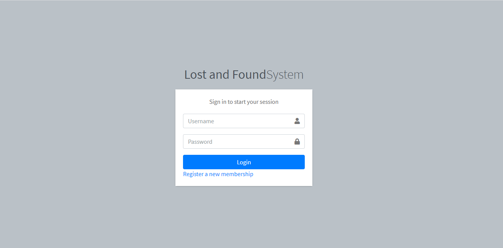
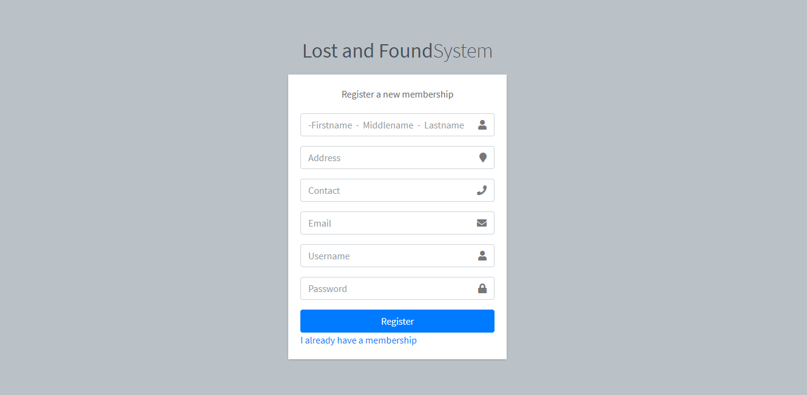
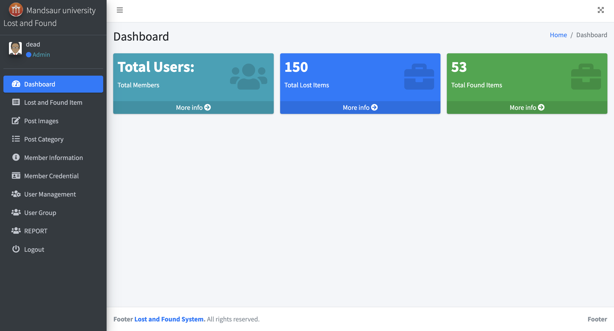

# Lost-and-Found-System
Created a user-friendly interface to ensure seamless interaction and efficient service delivery.

## Project Overview
The "Lost and Found System" presents a valuable solution for addressing the challenges associated with retrieving lost items in a user-friendly and efficient manner. The project aims to streamline the process of reporting and searching for lost items, enhancing user experience and community engagement.

## Features
- User registration and authentication
- Search functionality for lost and found items
- Secure data management

## Installation

- git clone https://github.com/jiteshporwal/Lost-and-Found-System.git
0 cd Lost-and-Found-System

## Screenshots
Here are some screenshots of the Rozgar Mitra platform:

- 

- 
- 
- 
- 
